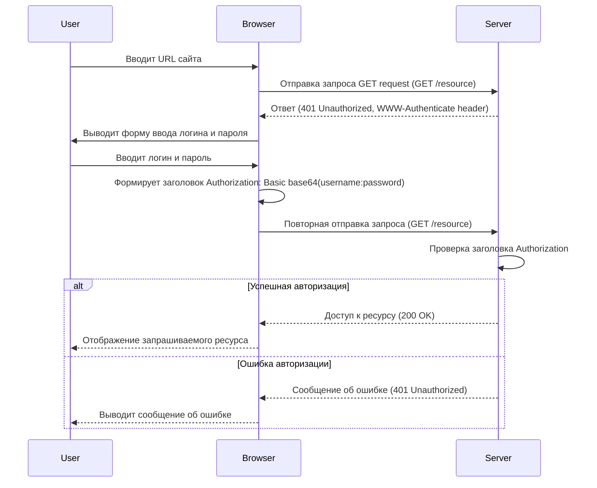

```mermaid
sequenceDiagram
    participant User
    participant Browser
    participant Server

    User->>Browser: Вводит URL сайта
    Browser->>Server: Отправка запроса GET request (GET /resource)
    Server-->>Browser: Ответ (401 Unauthorized, WWW-Authenticate header)
    Browser->>User: Выводит форму ввода логина и пароля
    User->>Browser: Вводит логин и пароль
    Browser->>Browser: Формирует заголовок Authorization: Basic base64(username:password)
    Browser->>Server: Повторная отправка запроса (GET /resource)
    Server->>Server: Проверка заголовка Authorization
    alt Успешная авторизация
        Server-->>Browser: Доступ к ресурсу (200 OK)
        Browser-->>User: Отображение запрашиваемого ресурса
    else Ошибка авторизации
        Server-->>Browser: Сообщение об ошибке (401 Unauthorized)
        Browser-->>User: Выводит сообщение об ошибке
    end


```
