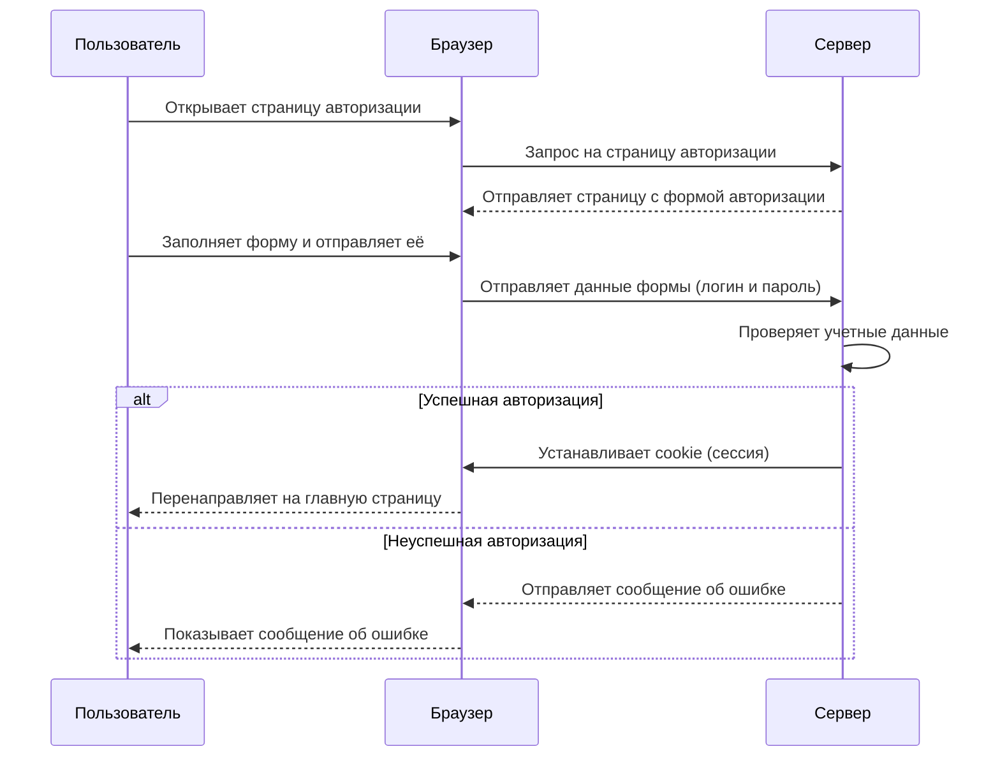

```mermaid
sequenceDiagram
    participant User as Пользователь
    participant Browser as Браузер
    participant Server as Сервер

    User->>Browser: Открывает страницу авторизации
    Browser->>Server: Запрос на страницу авторизации
    Server-->>Browser: Отправляет страницу с формой авторизации
    User->>Browser: Заполняет форму и отправляет её
    Browser->>Server: Отправляет данные формы (логин и пароль)
    Server->>Server: Проверяет учетные данные
    alt Успешная авторизация
        Server->>Browser: Устанавливает cookie (сессия)
        Browser-->>User: Перенаправляет на главную страницу
    else Неуспешная авторизация
        Server-->>Browser: Отправляет сообщение об ошибке
        Browser-->>User: Показывает сообщение об ошибке
    end
```
