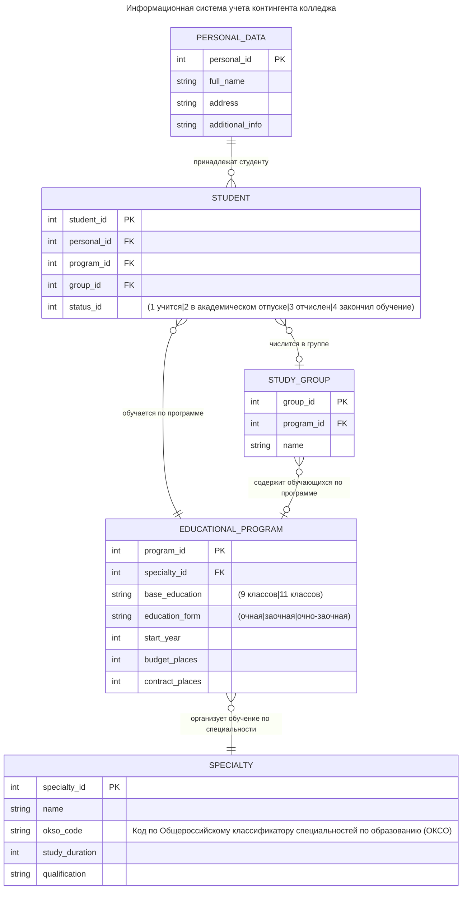

автор: anthropic/claude-3.5-sonnet

# 2. Проектирование структуры базы данных

## 2.1 Анализ сущностей и связей информационной системы

При проектировании базы данных информационной системы учета студентов были выделены следующие основные сущности и связи между ними:

### 2.1.1 Описание сущностей

**EDUCATIONAL_PROGRAM (Образовательная программа)**
Содержит информацию об образовательных программах, реализуемых в учебном заведении. Включает такие атрибуты как:
- Уникальный идентификатор программы
- Базовое образование (9 или 11 классов)
- Форма обучения (очная, заочная, очно-заочная)
- Год начала реализации программы
- Количество бюджетных и контрактных мест
- Связь со специальностью через внешний ключ specialty_id

**SPECIALTY (Специальность)**
Справочник специальностей с информацией:
- Наименование специальности
- Код специальности по ОКСО
- Срок обучения
- Присваиваемая квалификация

**PERSONAL_DATA (Личные данные)**
Хранит персональные данные физических лиц:
- ФИО
- Адрес
- Дополнительная информация
Вынесение персональных данных в отдельную таблицу обусловлено требованиями закона о персональных данных (152-ФЗ) и позволяет обеспечить дополнительный уровень защиты этой информации.

**STUDENT (Студент)**
Центральная сущность системы, связывающая:
- Личные данные студента
- Образовательную программу
- Учебную группу
- Текущий статус обучения

**STUDY_GROUP (Учебная группа)**
Содержит информацию об учебных группах:
- Наименование группы
- Связь с образовательной программой

### 2.1.2 Обоснование связей между сущностями

1. **PERSONAL_DATA ||--o{ STUDENT** (один-ко-многим)
- Один набор персональных данных может принадлежать нескольким студентам (например, в случае повторного поступления)
- Каждый студент обязательно должен иметь персональные данные
- Связь реализована через внешний ключ personal_id в таблице STUDENT

2. **STUDENT }o--|| EDUCATIONAL_PROGRAM** (многие-к-одному)
- Каждый студент может обучаться только по одной образовательной программе в определенный момент времени
- На одной образовательной программе может обучаться множество студентов
- Связь обязательна для студента (каждый студент должен быть привязан к программе)
- Связь необязательна для программы (могут существовать программы без студентов)

3. **STUDENT }o--o| STUDY_GROUP** (многие-к-одному, необязательная)
- Студент может быть привязан к учебной группе, но это не обязательно (например, при отчислении)
- В одной группе может быть множество студентов
- Связь реализована через внешний ключ group_id в таблице STUDENT

4. **STUDY_GROUP }o--o| EDUCATIONAL_PROGRAM** (многие-к-одному)
- Каждая группа привязана к конкретной образовательной программе
- На одной образовательной программе может быть несколько групп
- Связь необязательна с обеих сторон, так как могут существовать:
  - Программы без сформированных групп
  - Расформированные группы, которые нужно хранить в истории

5. **EDUCATIONAL_PROGRAM }o--|| SPECIALTY** (многие-к-одному)
- Каждая образовательная программа реализует только одну специальность
- По одной специальности может быть несколько образовательных программ (разные формы обучения, разные года набора)
- Связь обязательна для программы (каждая программа должна быть привязана к специальности)
- Связь необязательна для специальности (могут быть специальности без активных программ)

Такая структура связей обеспечивает:
- Целостность данных
- Возможность отслеживания истории обучения
- Гибкость при работе с учебными группами
- Соответствие требованиям нормализации базы данных
- Удобство формирования различных отчетов и выборок
