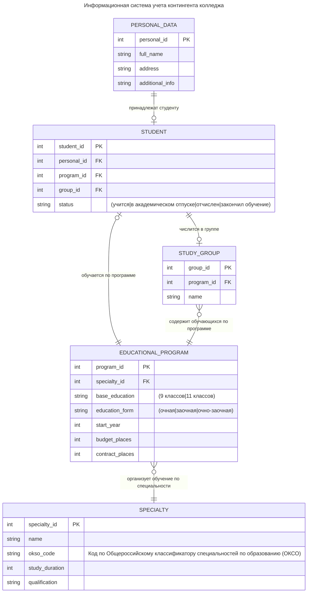

```mermaid
---
title: Информационная система учета контингента колледжа
---
%% Диаграмма описывает основные сущности для учета студентов в колледже
%% Добавить
%% 1) Хранение истории статусов
%% 2) Образовательные программы дополнительного образования
%% 3) Учесть возможность перевода с одной образовательной программы на другую
%% 4) Сущность Договор

erDiagram
    EDUCATIONAL_PROGRAM {
        int program_id PK
        int specialty_id FK
        string base_education "(9 классов|11 классов)"
        string education_form "(очная|заочная|очно-заочная)"
        int start_year
        int budget_places
        int contract_places
    }
    
    SPECIALTY {
        int specialty_id PK
        string name
        string okso_code "Код по Общероссийскому классификатору специальностей по образованию (ОКСО)"
        int study_duration
        string qualification
    }
    
    PERSONAL_DATA {
        int personal_id PK
        string full_name
        string address
        string additional_info
    }
    
    STUDENT {
        int student_id PK
        int personal_id FK
        int program_id FK
        int group_id FK
        string status "(учится|в академическом отпуске|отчислен|закончил обучение)"
    }
    
    STUDY_GROUP {
        int group_id PK
        int program_id FK
        string name
    }

    PERSONAL_DATA ||--o| STUDENT: "принадлежат студенту"
    STUDENT |o--|| EDUCATIONAL_PROGRAM   : "обучается по программе"
    STUDENT ||--o| STUDY_GROUP : "числится в группе"
    STUDY_GROUP }o--|| EDUCATIONAL_PROGRAM : "содержит обучающихся по программе"
    EDUCATIONAL_PROGRAM }o--|| SPECIALTY : "организует обучение по специальности"

```
