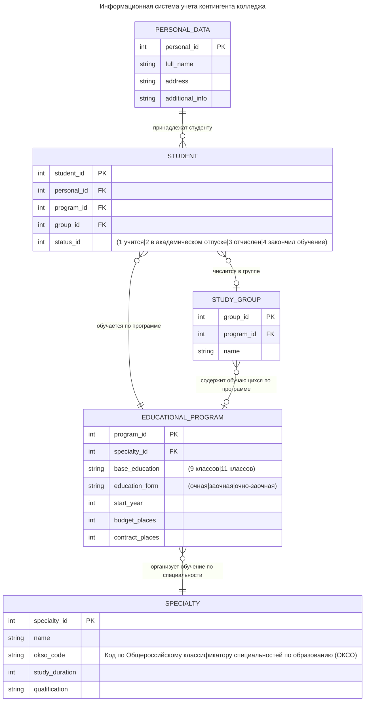

автор: openai/gpt-4o-mini

### Глава: Модель данных учебного заведения

В данной главе представлена ER (Entity-Relationship Diagram) модель данных для учебного заведения, отражающая взаимосвязи между различными сущностями, связанными с управлением образовательными программами, студентами и специальностями. Эта диаграмма является основой структуры базы данных, предназначенной для упрощения управления учебными процессами.

#### Описание сущностей

1. **EDUCATIONAL_PROGRAM (Образовательная программа)**: Сущность, описывающая программы обучения, предлагаемые учебным заведением. Включает в себя следующие атрибуты:
   - `program_id`: уникальный идентификатор программы (первичный ключ).
   - `specialty_id`: идентификатор специальности, к которой относится программа (внешний ключ).
   - `base_education`: уровень образования, необходимый для поступления (например, "9 классов" или "11 классов").
   - `education_form`: форма обучения (очная, заочная или очно-заочная).
   - `start_year`: год начала программы.
   - `budget_places` и `contract_places`: количество мест на бюджетной и контрактной основе соответственно.

2. **SPECIALTY (Специальность)**: Сущность, характеризующая специальности, по которым организуется обучение. Включает:
   - `specialty_id`: уникальный идентификатор специальности (первичный ключ).
   - `name`: наименование специальности.
   - `okso_code`: код специальности по Общероссийскому классификатору специальностей (ОКСО).
   - `study_duration`: продолжительность обучения по специальности.
   - `qualification`: квалификация, присваиваемая по завершении обучения.

3. **PERSONAL_DATA (Личные данные)**: Сущность, содержащая персональную информацию о студентах. Атрибуты включают:
   - `personal_id`: уникальный идентификатор личных данных (первичный ключ).
   - `full_name`: полное имя студента.
   - `address`: адрес проживания.
   - `additional_info`: дополнительная информация.

4. **STUDENT (Студент)**: Сущность, представляющая студентов учебного заведения. Включает:
   - `student_id`: уникальный идентификатор студента (первичный ключ).
   - `personal_id`: идентификатор личных данных студента (внешний ключ).
   - `program_id`: идентификатор программы обучения (внешний ключ).
   - `group_id`: идентификатор группы, в которой учится студент (внешний ключ).
   - `status_id`: статус студента (учится, в академическом отпуске, отчислен или закончил обучение).

5. **STUDY_GROUP (Учебная группа)**: Сущность, отражающая группы студентов, которые обучаются по одной программе. Включает следующие атрибуты:
   - `group_id`: уникальный идентификатор группы (первичный ключ).
   - `program_id`: идентификатор образовательной программы (внешний ключ).
   - `name`: название группы.

#### Взаимосвязи между сущностями

В данной диаграмме используются различные типы связей между сущностями, позволяющие точно отразить отношения, существующие в модели данных учебного заведения. Ниже представлено более детальное описание каждой из связей, включая те, которые обозначены как `}o--||` и `}o--o|`.

1. **PERSONAL_DATA ||--o{ STUDENT**: "принадлежат студенту"
   - **Тип связи**: Один ко многим (1:N).
   - **Описание**: Каждая запись в сущности **PERSONAL_DATA** может быть связана с несколькими записями в сущности **STUDENT**, но каждая запись в **STUDENT** может ссылаться только на одну запись в **PERSONAL_DATA**. Это объясняется тем, что один студент имеет уникальные личные данные, однако возможно, что у нескольких студентов будут разные записи личных данных.

2. **STUDENT }o--|| EDUCATIONAL_PROGRAM**: "обучается по программе"
   - **Тип связи**: Многие к одному (N:1).
   - **Описание**: Каждая запись в сущности **STUDENT** может ссылаться только на одну запись в **EDUCATIONAL_PROGRAM**, что означает, что каждый студент обучается по определенной образовательной программе. Тем не менее, одна образовательная программа может включать множество студентов.

3. **STUDENT }o--o| STUDY_GROUP**: "числится в группе"
   - **Тип связи**: Многие к одному (N:1) с множеством (0:M).
   - **Описание**: Каждая запись в сущности **STUDENT** принадлежит только одной учебной группе, но в рамках одной группы может находиться множество студентов. Это отражает реальность, что студенты обычно организуются в группы в зависимости от их образовательной программы или уровня обучения.

4. **STUDY_GROUP }o--o| EDUCATIONAL_PROGRAM**: "содержит обучающихся по программе"
   - **Тип связи**: Многие к одному (M:1) с множеством (0:M).
   - **Описание**: Каждая группа студентов (STUDY_GROUP) связана с одной образовательной программой (EDUCATIONAL_PROGRAM), но одна программа может иметь множество групп, представляющих ее студентов в разных подгруппах или потоках.

5. **EDUCATIONAL_PROGRAM }o--|| SPECIALTY**: "организует обучение по специальности"
   - **Тип связи**: Один к одному (1:1).
   - **Описание**: Каждая образовательная программа связана с одной специальностью, которую она охватывает. Это означет, что программа в основном соответствует одной области знания или теме, но может включать курсы, относящиеся к другим специальностям.

#### Заключение

Разнообразие типов связей в данной диаграмме важно для корректного представления структуры данных учебного заведения. Связи `}o--||` и `}o--o|` указывают на то, как могут взаимодействовать сущности в системе – одни поддерживают строгое ограничение на количество связей, в то время как другие допускают гибкость и возможность для множества записей. Эти детали необходимы для создания организованного и функционального механизма управления данными, что делает систему эффективной и легкой для администрирования.
